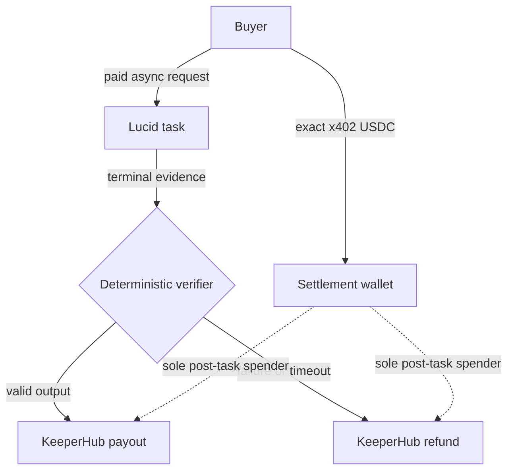

# Lucid × KeeperHub Settlement Recovery

Post-fulfillment payout and refund recovery for paid [Lucid Agents](https://github.com/daydreamsai/lucid-agents) tasks, executed through [KeeperHub](https://github.com/Keeper-Hub/KeeperHub).

> **Invariant:** x402 payment success does not authorize worker payout. USDC may leave the settlement wallet only after the Lucid task is terminal, a deterministic verifier fixes the outcome, KeeperHub simulates the transfer, and KeeperHub returns an independently verified successful receipt.

This is a working integration against the live Lucid and KeeperHub product surfaces—not a generic agent wrapper. The service exposes a real paid Lucid async capability, captures the verified x402 payer, persists the task and settlement decision in SQLite, and makes KeeperHub the sole post-task USDC execution path.

**Current evidence status:** the implementation and mocked end-to-end suite are complete. `public/evidence/receipts.json` intentionally stays empty until the funded Base Sepolia run produces real transaction hashes.

## Why it exists

Lucid can settle an x402 payment after task reservation but before asynchronous work finishes. Paying the worker directly makes a later failure commercially irreversible. This project instead sets Lucid's `payTo` to the KeeperHub-controlled settlement wallet and resolves the money only after fulfillment:



The wallet is deliberately called a **settlement wallet**, not escrow: this release does not deploy a trustless escrow contract.

## Money path

1. A buyer calls `audit_receipts`, a paid Lucid A2A entrypoint, with an `operationId`, worker address, and one to twenty Base Sepolia transaction hashes.
2. Lucid challenges the request with exact x402 payment for Base Sepolia USDC.
3. The buyer's payment settles to `PAYMENTS_RECEIVABLE_ADDRESS`, the wallet controlled by the KeeperHub organization.
4. The service binds the verified x402 payer, payment transaction, Lucid task ID, and `operationId` in SQLite. The Lucid `Idempotency-Key` must exactly equal the input `operationId`.
5. The task reads Base Sepolia receipts. A local deterministic verifier checks terminal status, completion deadline, output schema, unique hashes, receipt/count consistency, and receipt success.
6. The first verdict becomes immutable:
   - valid output → payout to the worker;
   - failed, cancelled, late, malformed, reverted, or missing evidence → refund to the verified x402 payer.
7. KeeperHub receives the transfer in its safe first-write sequence: simulate, broadcast once with a stable idempotency key, then poll the execution resource.
8. The operation becomes `paid` or `refunded` only when a KeeperHub receipt has both `verified: true` and `receiptStatus: "success"`.

## Security properties

| Boundary | Enforced behavior |
| --- | --- |
| Refund identity | Derived from the facilitator's successful x402 response; never accepted from task input |
| Network | Pinned to Base Sepolia (`eip155:84532`, chain ID `84532`) |
| Asset | Pinned to Circle USDC `0x036CbD53842c5426634e7929541eC2318f3dCF7e` |
| Custody | Lucid `payTo`, configured wallet, and KeeperHub's simulated `from` address must all match |
| Decision | First terminal outcome and payout/refund direction are immutable |
| Replay | `lucid-settlement:v1:<operationId>:<direction>` names the write across retries |
| Preflight | A reverting or unsuccessful KeeperHub simulation moves the operation to `blocked` |
| Finality | A broadcast acknowledgement or self-reported hash is never treated as final |
| Recovery | Lucid tasks, execution IDs, decisions, and receipts survive process restart in SQLite |
| Replay expiry | An uncertain write without a saved execution ID blocks after KeeperHub's 24-hour replay window |
| Evidence | One record joins the payment tx, Lucid task, operation, KeeperHub execution, and settlement tx |

See [the threat model](docs/threat-model.md) for trust assumptions and known limitations.

## Repository map

```text
src/lucid/                 Paid Lucid task, Base Sepolia receipt audit, durable task store
src/settlement/            Verifier, state machine, coordinator, stores, idempotency
src/keeperhub/             simulate → execute → verified-status REST adapter
src/x402/                  verified payer and payment evidence extraction
scripts/live-demo.ts       funded payout/refund runner and public evidence generator
tests/unit/                unit, persistence, adapter, and real Lucid integration tests
app/ + components/         proof-first public dashboard
public/evidence/           dashboard-readable receipt bundle
```

## Run locally

Prerequisites:

- Node.js 22.13 or newer (the durable task store uses `node:sqlite`)
- a KeeperHub organization wallet on Base Sepolia with USDC custody and Base Sepolia ETH for gas
- a KeeperHub API key allowed to simulate and broadcast direct transfers
- an x402 facilitator compatible with Lucid's exact scheme
- a Base Sepolia JSON-RPC endpoint

```bash
npm ci
cp .env.example .env
# Fill the required values in .env; never commit this file.
npm run agent:dev
```

The service listens at `http://localhost:8788` by default:

| Surface | Endpoint |
| --- | --- |
| Agent card | `GET /api/agent/.well-known/agent-card.json` |
| Paid async task | `POST /api/agent/tasks` |
| Lucid task state | Lucid A2A task routes under `/api/agent` |
| Settlement list | `GET /api/settlements` |
| Settlement evidence | `GET /api/settlements/:operationId` |

Run the audit dashboard separately with `npm run dev`.

## Live Base Sepolia proof

The runner uses Lucid's current A2A client and x402 payer, not a bypass endpoint. It submits one valid receipt for payout and a generated nonexistent hash for refund, waits for both Lucid tasks, waits for verified KeeperHub receipts, and publishes a secret-free evidence bundle.

Add the live-run values from `.env.example`, then keep the agent service running and execute:

```bash
npm run demo:live
```

For the evidence target of ten payouts and ten refunds:

```bash
DEMO_RUNS_PER_PATH=10 npm run demo:live
```

The command writes the same verified bundle to:

- `artifacts/receipts.json` for submission evidence;
- `public/evidence/receipts.json` for the dashboard.

The runner refuses to publish an operation without a KeeperHub execution ID, settlement transaction hash, and verified receipt. Full setup and failure-injection steps are in [the demo runbook](docs/demo.md).

## Verify the implementation

```bash
npm run test:unit
npx tsc --noEmit
npm run lint
npm test
```

The suite covers payout, refund, timeout, invalid output, payer binding, wrong `payTo`, dry-run blocking, stable idempotency, receipt finality, SQLite reopening, and an end-to-end paid task through the real Lucid Hono runtime with mocked external networks.

## Explicit limitations

- Testnet only: Base Sepolia and one pinned USDC deployment.
- The settlement wallet is operator-controlled custody, not an onchain escrow contract.
- The service releases the full task price to the worker; protocol-fee splitting is outside this MVP.
- A crash after x402 settlement but before local reservation can require reconciliation. The response is marked `X-Settlement-Capture: reconciliation-required` when that failure is observable.
- Lucid task and settlement records are durable, but the Lucid payments plugin's payment-accounting store is in-memory in this single-process release.
- SQLite is suitable for the demo and single-node deployment, not a horizontally scaled production service.
- Definite failed KeeperHub executions stop in `settlement_failed` for operator review; the system never changes recipient or rotates the idempotency key automatically.
- An unresolved write whose execution ID was not saved must recover inside KeeperHub's 24-hour idempotency window; after that the adapter blocks instead of risking a second transfer.

## License

[MIT](LICENSE)
